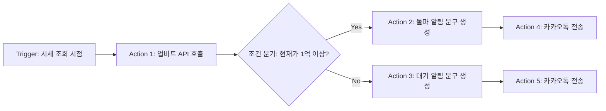
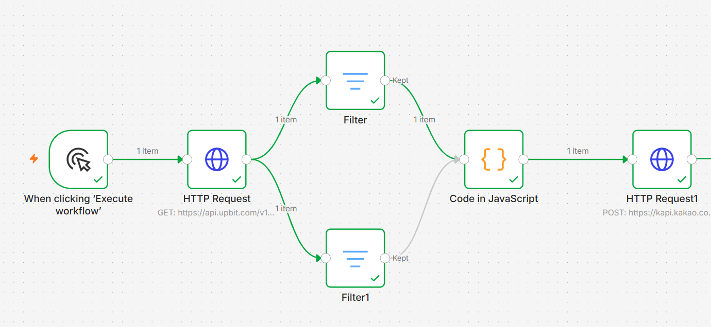
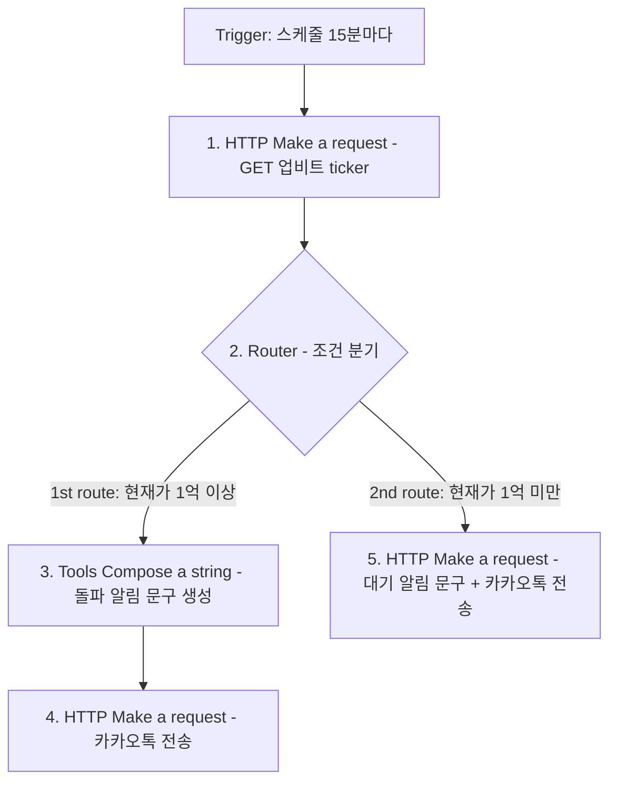
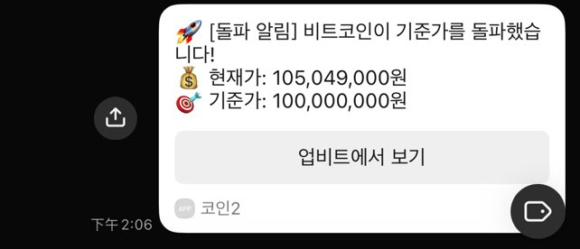

# B1-3 · 노코드 자동화 기초: 워크플로우 설계

> 업비트 비트코인 시세를 주기적으로 조회해 **1억 원 돌파 여부에 따라 서로 다른 알림을 카카오톡으로 전송**하는 자동화를 **n8n**과 **Make** 두 도구로 각각 구현하고 비교한 기록입니다.

| 항목 | 내용 |
|---|---|
| 분야 | AI 도구 학습 |
| 구분 | AI 도구 |
| 학습시간 | 40시간 |
| 사용 도구 | n8n, Make (Integromat) |
| 연동 서비스 | 업비트 Open API, 카카오톡 메시지 API |

---

## 1. 핵심 개념 정리

### 1.1 Trigger (트리거)

워크플로우를 **시작시키는 이벤트**입니다. 트리거가 없으면 워크플로우는 스스로 돌지 않습니다.

| 유형 | 설명 | 본 과제에서 |
|---|---|---|
| 수동 실행 | 사람이 버튼을 눌러 시작 | n8n `When clicking Execute workflow` (개발·검증용) |
| 스케줄 | 정해진 주기마다 자동 시작 | Make `Every 15 minutes` (운영용) |
| 웹훅 | 외부에서 HTTP 요청이 오면 시작 | 본 과제 미사용 |

### 1.2 Action (액션)

트리거 이후 실행되는 **처리 동작**입니다. 외부 API 호출, 데이터 가공, 저장, 알림 발송 등이 모두 액션입니다.

본 과제의 액션은 3종류입니다.

1. **데이터 수집** — 업비트 API에서 BTC 시세 조회 (HTTP GET)
2. **데이터 가공** — 조회한 가격을 사람이 읽을 메시지 문구로 변환
3. **알림 발송** — 카카오톡 "나에게 보내기" API 호출 (HTTP POST)

### 1.3 조건 분기 (Filter / Router)

**데이터의 값에 따라 실행 경로를 나누는 장치**입니다. 같은 데이터라도 조건에 따라 다른 결과를 만들어야 할 때 사용합니다.

| 방식 | 동작 | 도구 |
|---|---|---|
| **Filter** | 조건을 만족하는 데이터만 다음 단계로 통과시킴 (통과/차단) | n8n |
| **Router** | 데이터를 여러 경로로 분기시키고, 각 경로마다 필터를 걸 수 있음 | Make |

본 과제에서는 `trade_price`(현재가)를 기준으로 분기합니다.

- **1억 원 이상** → 🚀 돌파 알림
- **1억 원 미만** → 📉 대기 알림

---

## 2. [프로젝트 1] 자동화 도구 비교 구현

### 2.1 공통 워크플로우 정의

두 도구에 **동일한 구조**를 구현했습니다.



**사용 API**

| 구분 | 엔드포인트 | 메서드 | 인증 |
|---|---|---|---|
| 업비트 시세 조회 | `https://api.upbit.com/v1/ticker?markets=KRW-BTC` | GET | 불필요 (공개 API) |
| 카카오톡 나에게 보내기 | `https://kapi.kakao.com/v2/api/talk/memo/default/send` | POST | `Authorization: Bearer ***` |

> 🔒 카카오 access token은 보고서·스크린샷에서 모두 `***`로 마스킹했습니다.

**전송 메시지 예시**

```
🚀 [돌파 알림] 비트코인이 1억을 넘었습니다!
💰 현재가: 105,240,000원
[업비트에서 보기]
```

```
📉 [대기 알림] 비트코인이 아직 1억 미만입니다.
💰 현재가: 98,500,000원
[업비트에서 보기]
```

### 2.2 n8n 구현



실행 환경은 **n8n Cloud 무료 트라이얼**(`sum128.app.n8n.cloud`)입니다.

| 순서 | 노드 | 역할 |
|---|---|---|
| 1 | `When clicking Execute workflow` | **Trigger** — 수동 실행 |
| 2 | `HTTP Request` | **Action** — 업비트 GET 요청 |
| 3 | `Filter` / `Filter1` | **조건 분기** — 두 갈래 (아래 표 참고) |
| 4 | `Code in JavaScript` | **Action** — 메시지 문구 생성 |
| 5 | `HTTP Request1` | **Action** — 카카오톡 POST 전송 |

**조건 분기 설정**

| 노드 | 조건식 | 연산자 | 기준값 | 의미 |
|---|---|---|---|---|
| `Filter` | `{{ $json.trade_price }}` | is greater than or equal to | `100,000,000` | 1억 원 이상 |
| `Filter1` | `{{ $json.trade_price }}` | is less than | `100,000,000` | 1억 원 미만 |

두 필터는 `HTTP Request` 노드의 출력을 각각 받아 **한쪽만 통과**시키고, 통과한 데이터는 모두 `Code in JavaScript` 노드로 모입니다.

**Code 노드 (JavaScript)**

```javascript
const items = $input.all().map(item => item.json);

// 1. 비트코인 데이터 찾기
const btcData = items.find(item => item.market === 'KRW-BTC');

// 데이터가 없으면 중단
if (!btcData || !btcData.trade_price) {
  return [{ json: { message: "비트코인 정보를 불러오지 못했습니다." } }];
}

const price = btcData.trade_price;
const formattedPrice = price.toLocaleString('ko-KR');
let finalMessage = "";

// 2. 1억(100,000,000) 이상/미만 조건에 따라 메시지 다르게 설정
if (price >= 100000000) {
  finalMessage = "🚀 [돌파 알림] 비트코인이 1억을 넘었습니다!\n💰 현재가: " + formattedPrice + "원";
} else {
  finalMessage = "📉 [대기 알림] 비트코인이 아직 1억 미만입니다.\n💰 현재가: " + formattedPrice + "원";
}

// 3. 결과 출력
return [{ json: { message: finalMessage } }];
```

n8n은 **표현식 자체가 JavaScript**이기 때문에, 조건 분기와 문구 생성을 Code 노드 하나에서 익숙한 문법으로 처리할 수 있었습니다. `toLocaleString('ko-KR')` 한 줄로 천 단위 쉼표가 해결되는 점도 편했습니다.

> **설계상 짚어둘 점** — 이 구조에서는 분기 판정이 **두 번** 일어납니다. Filter 노드가 한 번 걸러내고, 두 경로가 다시 합류한 Code 노드에서 `if/else`로 한 번 더 판정합니다. 즉 Code 노드만으로도 결과는 같습니다.
> Make 버전에서는 이 중복을 없애고 **라우터 필터가 분기를 전담**하도록 정리했습니다. 같은 요구사항이라도 "판정을 어디서 할 것인가"를 도구에 맞게 선택해야 한다는 것을 알 수 있는 대목입니다.

**실행 결과**


### 2.3 Make 구현


| 순서 | 모듈 | 역할 |
|---|---|---|
| 1 | `HTTP — Make a request` (GET) | **Trigger + Action** — 15분 스케줄로 실행되며 업비트 조회 |
| 2 | `Flow Control — Router` | **조건 분기** — 2개 경로로 분기 |
| 3-1 | 1st route 필터 `trade_price ≥ 100000000` | 돌파 경로 |
| 3-2 | `Tools — Compose a string` | **Action** — 돌파 알림 문구 생성 |
| 3-3 | `HTTP — Make a request` (POST) | **Action** — 카카오톡 전송 |
| 4-1 | 2nd route 필터 `trade_price < 100000000` | 대기 경로 |
| 4-2 | `HTTP — Make a request` (POST) | **Action** — 대기 알림 문구 생성 + 카카오톡 전송 |

**Make 표현식**

Make는 IML(Integromat Markup Language)이라는 자체 표현식을 씁니다. JavaScript가 아니므로 n8n 코드를 그대로 옮길 수 없었습니다.

```
🚀 [돌파 알림] 비트코인이 1억을 넘었습니다!\n💰 현재가: formatNumber(parseNumber(trade_price;.);0;.;,)원
```

- `parseNumber(...)` — 업비트 값이 **문자열**로 넘어오므로 숫자로 변환 (이 단계를 빼면 `formatNumber`가 NaN 오류)
- `formatNumber(값;0;.;,)` — 소수점 0자리, 소수 구분자 `.`, 천 단위 구분자 `,` → `105,240,000`
- `trade_price` 는 **오른쪽 매핑 패널에서 클릭해 삽입**한 항목입니다 (직접 타이핑하면 문자열로 저장되어 동작하지 않음)

**카카오 요청 본문 (`application/x-www-form-urlencoded`)**

```
template_object = {"object_type":"text","text":"<생성된 문구>","link":{"web_url":"https://upbit.com/exchange?code=CRIX.UPBIT.KRW-BTC","mobile_web_url":"https://upbit.com/exchange?code=CRIX.UPBIT.KRW-BTC"},"button_title":"업비트에서 보기"}
```

**실행 결과 — 두 분기 모두 실행 확인**


라우터의 **1st 경로와 2nd 경로가 같은 실행에서 모두 체크 처리**된 것을 확인할 수 있습니다.


### 2.4 비교 분석

| # | 비교 항목 | n8n | Make |
|---|---|---|---|
| 1 | **UI/UX** | 좌→우로 흐르는 노드 캔버스. 분기가 시각적으로 넓게 퍼져 한눈에 구조 파악이 쉬움 | 원형 모듈이 체인으로 이어지는 형태. 모듈 수가 늘면 가로로 길어져 스크롤이 잦음 |
| 2 | **조건 분기 방식** | `Filter` 노드를 병렬로 2개 배치. 각 노드가 독립적이라 추가/삭제가 자유로움 | `Router` 1개 + 경로별 필터. 드롭다운(값·연산자·기준값)으로 설정해 **문법 오류 여지가 없음** |
| 3 | **데이터 가공 / 표현식** | **JavaScript 그대로 사용**. `if/else`, `toLocaleString()` 등 익숙한 문법 | **IML 자체 함수**. `formatNumber`, `parseNumber`, `escapeJSON` 등을 익혀야 함. JS 지식이 통하지 않음 |
| 4 | **데이터 참조(매핑) 방식** | `$json.field` 형태로 **타이핑 가능**, 자동완성 지원 | **반드시 매핑 패널에서 클릭해 삽입**해야 함. 타이핑하면 문자열 리터럴로 저장되어 조용히 실패 |
| 5 | **타입 처리** | JS가 암묵적으로 형변환 | API가 준 숫자도 **문자열로 전달**되어 `parseNumber` 명시 변환이 필요 |
| 6 | **실행 로그 / 디버깅** | 노드별 입력·출력 JSON을 즉시 확인. 특정 노드만 재실행 가능 | 실행 후 모듈 위 버블로 입출력 확인. `History` 탭에 실행 이력이 남고 단계별 데이터 조회 가능 |
| 7 | **오류 메시지 품질** | JS 런타임 오류가 그대로 노출되어 원인 추적이 직관적 | `NaN is not a valid number`처럼 **원인 지점이 모호**한 경우가 있어 이분 탐색이 필요했음 |
| 8 | **무료 플랜 범위** | **Cloud 무료 트라이얼: 1,000 executions + 기간 제한(본 과제 진행 중 2일 남음)**. 트라이얼 종료 후에는 유료 또는 셀프호스팅으로 전환해야 함. 셀프호스팅은 실행 횟수 무제한(서버는 직접 준비) | 월 1,000 operations 무료, **기간 제한 없음**. 다만 모듈 3~4개 × 실행이라 **15분 주기로 돌리면 월 한도를 초과** |
| 9 | **설치 / 접근성** | Cloud는 가입 즉시 사용 가능하나 **무료 기간이 끝나면 셀프호스팅 구성이 필요** | **가입 즉시 브라우저에서 사용**, 기간 제한 없이 무료 한도 유지 |
| 10 | **스케줄 실행** | Schedule Trigger 노드로 설정 | 하단 토글 + 주기 선택으로 즉시 활성화 |

### 2.5 장단점 정리

**n8n**

- 👍 JavaScript를 그대로 쓸 수 있어 복잡한 데이터 가공에 압도적으로 유리
- 👍 노드별 입출력을 바로 볼 수 있어 디버깅 속도가 빠름
- 👍 셀프호스팅 시 실행 횟수 제약이 없음
- 👎 **Cloud 무료 버전은 기간 제한이 있어** 과제 종료 후 계속 쓰려면 유료 전환 또는 셀프호스팅 구성이 필요
- 👎 셀프호스팅을 선택하면 설치·운영 환경을 직접 관리해야 함
- 👎 코드를 모르면 오히려 진입장벽이 생김

**Make**

- 👍 설치 없이 바로 시작, 커넥터가 많고 UI가 정돈되어 있음
- 👍 필터·라우터가 GUI라 **조건 분기 설계에서 실수가 없음**
- 👎 표현식이 자체 문법이고 에디터가 까다로움 (중괄호 직접 입력 불가, 매핑은 클릭 필수, 함수 인자에 따옴표·공백 금지)
- 👎 무료 1,000 ops는 짧은 주기 자동화에 금방 소진됨

### 2.6 어떤 상황에 어떤 도구가 적합한가

| 상황 | 추천 | 이유 |
|---|---|---|
| 데이터 가공 로직이 복잡함 (파싱, 계산, 조건 중첩) | **n8n** | JS 한 노드로 끝나는 일을 Make에서는 여러 함수로 쪼개야 함 |
| 실행 횟수가 많음 (분 단위 폴링 등) | **n8n (셀프호스팅)** | Make 무료 1,000 ops로는 감당 불가 |
| 코딩 경험이 없는 팀원과 함께 관리 | **Make** | 필터·라우터가 드롭다운이라 비개발자도 수정 가능 |
| 서버 없이 빠르게 붙여야 함 | **Make** | 가입 즉시 사용, 인프라 관리 불필요 |
| SaaS 커넥터를 폭넓게 써야 함 | **Make** | 기성 커넥터가 풍부해 HTTP 직접 호출을 줄일 수 있음 |

**본 과제 결론** — 학습 목적과 "설치 없이 자동 실행"이라는 조건에서는 **Make**가 적합했고, 로직이 더 복잡해지면 **n8n**으로 옮기는 것이 합리적이라고 판단했습니다.

---

## 3. [프로젝트 2] 자유 주제 자동화 설계 및 구현

### 3.1 자동화할 반복 업무 정의

> **"비트코인 시세를 수동으로 확인하는 일"**

기존에는 하루에도 몇 번씩 업비트 앱을 열어 BTC 가격이 목표선(1억 원)을 넘었는지 눈으로 확인했습니다. 한 번에 1분이 채 안 걸리지만 하루 10번이면 10분, 한 달이면 5시간입니다. 게다가 **확인하지 않는 순간에 가격이 움직이면 놓칩니다.**

| 구분 | 자동화 전 | 자동화 후 |
|---|---|---|
| 확인 방법 | 앱을 직접 열어 확인 | 카카오톡 알림 수신 |
| 확인 주기 | 생각날 때 (불규칙) | 15분마다 (규칙적) |
| 놓칠 위험 | 있음 | 없음 |
| 소요 시간 | 하루 약 10분 | 0분 |

### 3.2 도구 선정 및 선정 이유

**선정 도구: Make**

| 선정 이유 | 설명 |
|---|---|
| **무료 사용 기간 제한이 없음** | n8n Cloud는 무료 트라이얼이 곧 만료(과제 진행 중 2일 남음)되어 알림이 끊깁니다. Make는 월 1,000 ops 한도 안에서는 기간 제한 없이 계속 돌아갑니다 |
| 서버 불필요 | 24시간 켜둘 PC나 서버 없이 클라우드에서 자동 실행됨. n8n을 셀프호스팅으로 돌리면 PC를 꺼둔 동안 알림이 멈춤 |
| 스케줄 설정이 간단 | 하단 토글 + 주기 선택만으로 자동 실행 활성화 |
| 조건 분기가 GUI | 기준가를 1억 → 1억 2천만으로 바꾸는 작업이 드롭다운 숫자 수정 한 번 |
| 실행 이력 보존 | History 탭에서 언제 어떤 값으로 실행됐는지 사후 확인 가능 |

### 3.3 워크플로우 설계



**단계별 설명**

1. **트리거 (15분 주기)** — Make 스케줄러가 15분마다 시나리오를 깨웁니다. 사람의 조작이 전혀 필요 없습니다.
2. **시세 조회** — 업비트 공개 API에 GET 요청을 보냅니다. `Parse response: Yes`로 두어 응답 JSON이 매핑 가능한 구조(`data[].trade_price`)로 들어옵니다.
3. **조건 분기 (Router)** — 라우터가 두 경로로 데이터를 흘려보내고, 각 경로의 필터가 현재가를 1억 원과 비교해 **한쪽만 통과**시킵니다.
4. **문구 생성** — 현재가를 `parseNumber`로 숫자화한 뒤 `formatNumber`로 천 단위 쉼표를 붙여 사람이 읽을 문장으로 만듭니다.
5. **카카오톡 전송** — `template_object`에 JSON을 담아 POST합니다. 메시지 하단에는 업비트로 바로 이동하는 버튼이 붙습니다.

### 3.4 구현 및 실행 결과


스케줄 토글이 켜진 상태이며, 15분마다 자동 실행됩니다.




> 📌 대기 알림은 검증 시점에 실제 시세가 1억 원을 넘어 있었기 때문에, **기준값을 일시적으로 2억 원으로 올려 미만 경로를 실행**시켜 확인한 뒤 원래 값(1억 원)으로 되돌렸습니다.

---

## 4. 요구사항 충족 체크리스트

### 공통 요구사항

| 요구사항 | 충족 | 근거 |
|---|:---:|---|
| 실제로 동작하는 워크플로우 | ✅ | 두 도구 모두 카카오톡 수신 확인 |
| Trigger 1개 이상 | ✅ | n8n: 수동 실행 / Make: 15분 스케줄 |
| Action 2개 이상 | ✅ | API 조회 + 문구 생성 + 메시지 전송 (3개 이상) |
| 조건 분기 1개 이상 | ✅ | n8n: Filter 2개 / Make: Router + 경로별 필터 |
| 각 분기 경로 1회 이상 실행 결과 확인 | ✅ | Make 라우터 1st·2nd 경로 동시 실행 성공 (`images/04`) |

### 프로젝트 1

| 요구사항 | 충족 |
|---|:---:|
| 서로 다른 2개 이상의 도구 사용 | ✅ n8n, Make |
| 동일한 워크플로우 구조로 구현 | ✅ |
| 사용한 도구 이름 명시 | ✅ 2.2 / 2.3 |
| 구현 과정 요약 | ✅ 2.2 / 2.3 |
| 비교 항목 5개 이상 | ✅ **10개** (2.4) |
| 각 도구의 장단점 정리 | ✅ 2.5 |
| 어떤 상황에 적합한지 의견 | ✅ 2.6 |

### 프로젝트 2

| 요구사항 | 충족 |
|---|:---:|
| 반복 업무 1개 정의 | ✅ 3.1 |
| 도구 1개 선정 + 선정 이유 | ✅ 3.2 |
| 자동 실행 구조 구현 | ✅ 15분 스케줄 활성화 |
| 워크플로우 흐름 설명 | ✅ 3.3 (다이어그램 + 단계별 설명) |

### 제약 사항

| 제약 | 준수 |
|---|:---:|
| 도구 2개 이상 직접 사용 | ✅ |
| 두 프로젝트 모두 실제 동작 | ✅ |
| 프로젝트 2 자동 실행 | ✅ |
| 민감정보 마스킹 | ✅ access token 전부 `***` 처리 |
| 무료 플랜 범위 | ✅ 유료 결제 없이 구현 |

---

## 5. 트러블슈팅 기록

> 이 과제에서 **가장 오래 걸린 부분은 워크플로우 설계가 아니라, n8n 문법을 Make로 옮기는 과정**이었습니다. 같은 실수를 반복하지 않기 위해 기록해 둡니다.

### 5.1 JSON.stringify 함수가 없다

```
Failed to map '0.value': Function 'JSON.stringify' not found!
```

n8n은 표현식이 JavaScript라 `JSON.stringify({...})`가 동작하지만, **Make의 IML에는 이 함수도 객체 리터럴 문법도 없습니다.** JSON 문자열을 직접 작성하는 방식으로 교체했습니다. (Make의 JSON 이스케이프 함수는 `toJSON`이 아니라 `escapeJSON`입니다.)

### 5.2 응답 필드명이 body가 아니라 data

n8n 습관대로 `$json.body[0].trade_price`를 옮겨 `2.body`로 참조했으나 값이 비었습니다. **Make의 HTTP 모듈은 파싱된 응답을 `data`에 담습니다.** 또한 `2`는 라우터(출력 없음)여서 실제로는 `1.data`가 맞았습니다.

### 5.3 매핑을 타이핑하면 문자열이 된다

```
Function 'formatNumber' finished with error! 'NaN' is not a valid number
```

`formatNumber(1.data[].trade_price; ...)`를 **손으로 타이핑**하면 Make가 이를 참조가 아닌 **문자열 리터럴**로 저장합니다. 오른쪽 매핑 패널에서 클릭해 삽입해야 파란 칩으로 들어가고 값이 해석됩니다.

### 5.4 중괄호를 직접 입력하면 그대로 전송된다

카카오톡에 `{{105 ,251 ,000}}원` 이라는 메시지가 도착했습니다. Make 새 에디터에서는 **중괄호를 타이핑하면 문자 그대로 저장**됩니다. 함수명과 여는 괄호만 입력하면 에디터가 자동으로 수식으로 인식합니다.

### 5.5 함수 인자에 따옴표·띄어쓰기 금지

`formatNumber(x;0;".";",")` → 결과가 `105","240","000`. 따옴표까지 문자로 들어갑니다. 또 `; ,` 처럼 세미콜론 뒤에 공백을 두면 구분자가 공백+쉼표가 되어 `105 ,240 ,000`이 됩니다. **`;0;.;,` 처럼 붙여 써야 합니다.**

### 5.6 if() 안의 비교식이 항상 참이 된다

`if(parseNumber(x;.) >= 100000000; A; B)`로 작성했으나 값이 1억 미만이어도 항상 A가 나왔습니다. 확인 결과 **Make 에디터가 `>= 100000000`을 문자열로 저장**해 조건이 늘 참이 되고 있었습니다.

→ **`if()`를 포기하고 Router + 필터(드롭다운 UI)로 전환**했습니다. 결과적으로 과제가 요구하는 조건 분기 구조와도 더 잘 맞고, n8n의 Filter 2개 구조와도 대응됩니다.

### 5.7 URL 끝의 /send가 사라진다

Make 입력 필드는 슬래시를 입력하면 함수 검색 모드로 전환됩니다. URL 맨 끝의 `/send`가 이 기능에 먹혀 저장되지 않았습니다. 다른 필드에서 **복사·붙여넣기**로 해결했습니다.

### 5.8 카카오 토큰 만료

```
{"msg":"this access token is already expired","reason":"ACCESS_TOKEN_EXPIRED","code":-401}
```

카카오 access token은 **약 6시간이면 만료**됩니다. 본 과제에서는 토큰을 수동 갱신했으나, 실제 운영이라면 refresh token으로 갱신하는 단계를 앞에 두어야 합니다.

---

## 6. 한계와 개선 방향

| # | 한계 | 개선 방향 |
|---|---|---|
| 1 | **토큰 수동 갱신** — 카카오 access token이 6시간마다 만료되어 알림이 멈춤 | 앞단에 refresh token으로 갱신하는 HTTP 모듈을 추가하거나 Make의 카카오 커넥션 사용 |
| 2 | **매 실행마다 알림 발송** — 1억 미만이면 "아직 미만" 알림이 15분마다 옴 (하루 96건) | 상태 저장(Data store)으로 **직전 상태와 달라졌을 때만** 발송하도록 변경 |
| 3 | **무료 플랜 초과** — 15분 주기 × 모듈 3~4개면 월 1,000 ops를 넘김 | 주기를 1시간으로 늘리거나, n8n 셀프호스팅으로 이전 |
| 4 | **단일 종목·단일 기준** | 감시 종목과 기준가를 Data store에 두고 반복 처리 |
| 5 | **오류 알림 없음** | 실패 시 별도 채널로 통지하는 error handler 경로 추가 |

---

## 7. 배운 점

1. **Trigger와 Action의 분리**가 자동화 설계의 출발점이라는 것을 체감했습니다. "언제 시작할지"와 "무엇을 할지"를 나눠 생각하니 워크플로우가 자연스럽게 그려졌습니다.
2. **조건 분기는 코드보다 GUI가 안전할 수 있습니다.** n8n에서는 `if/else` 한 줄이면 될 일이 Make에서는 문법 문제로 계속 실패했는데, 라우터 필터(드롭다운)로 바꾸자 한 번에 해결됐습니다. 도구가 잘하는 방식을 따르는 것이 빠릅니다.
3. **같은 워크플로우도 도구에 따라 난이도가 완전히 달라집니다.** 도구 선택은 취향이 아니라 **작업의 성격(로직 복잡도 · 실행 빈도 · 운영 주체)** 에 따라 결정해야 한다는 것을 배웠습니다.
4. **오류 메시지를 끝까지 읽는 습관**이 중요했습니다. `NaN is not a valid number`, `105231000 is not a valid array` 같은 메시지가 결국 정확한 원인을 알려줬습니다.

---

## 부록 · 스크린샷 목록

| 파일 | 내용 |
|---|---|
| `images/01-n8n-workflow.png` | n8n 워크플로우 전체 구성 |
| `images/02-n8n-execution.png` | n8n 실행 결과 |
| `images/03-make-scenario.png` | Make 시나리오 전체 구성 |
| `images/04-make-execution.png` | Make 실행 결과 (양쪽 분기 모두 성공) |
| `images/05-make-history.png` | Make 실행 로그 (History) |
| `images/06-make-schedule-on.png` | Make 스케줄 활성화 상태 |
| `images/07-kakao-breakout.png` | 카카오톡 수신 — 돌파 알림 |
| `images/08-kakao-waiting.png` | 카카오톡 수신 — 대기 알림 |
